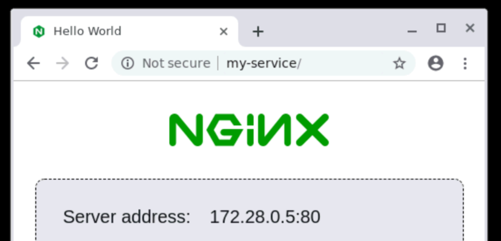

> Docker scripts to start a Selenium grid

[](https://travis-ci.com/NiGhTTraX/tdd-buffet) [](https://codecov.io/gh/NiGhTTraX/tdd-buffet)

----

## Requirements

- Docker 1.12.0+
- docker-compose 1.18.0+


## Start a grid with Chrome and Firefox

```sh
npx @tdd-buffet/selenium start [N=1] --port 4444 --retries 15
```

The hub will listen at `0.0.0.0:4444` and it will have 2*N browser nodes (N Chrome and N Firefox):


## Start a grid with debug nodes with VNC

```sh
npx @tdd-buffet/selenium debug --port 3333 --retries 15
```

The same hub as above will spin up, but this time only 2 nodes (Chrome and Firefox) with VNC enabled will connect. VNC is available at `0.0.0.0:5900` (Chrome) and `0.0.0.0:5901` (Firefox).


## Mount files inside the nodes

You can mount files inside the node containers at `/var/ww/html` using the `--html` option:

```sh
npx @tdd-buffet/selenium start --html my-host-dir
```

The path is resolved relative to the current working directory.


## Connect other containers

When spinning up the grid a network named `tdd-buffet` is created. You can make other containers visible to the grid nodes by having them join the same network - they will then be accessible through their name. Here's an example using `docker-compose`:

```yaml
version: '2.1'

services:
  my-service:
    image: nginxdemos/hello
    networks:
      - tdd-buffet
    expose:
      - 80

networks:
  tdd-buffet:
    external: true # this tells docker-compose that the
                   # network was created outside this project
```

```sh
npx @tdd-buffet/selenium start
docker-compose up -d
# Now you can tell the hub to access http://my-service
```




## Stop everything

```sh
npx @tdd-buffet/selenium stop
```

